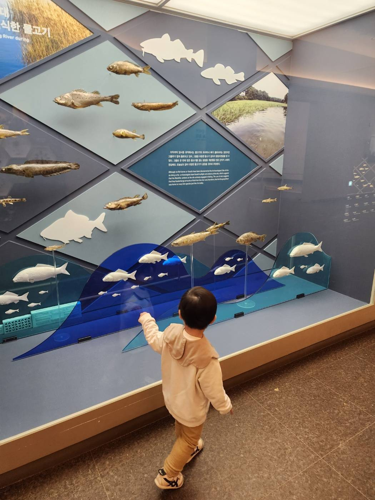
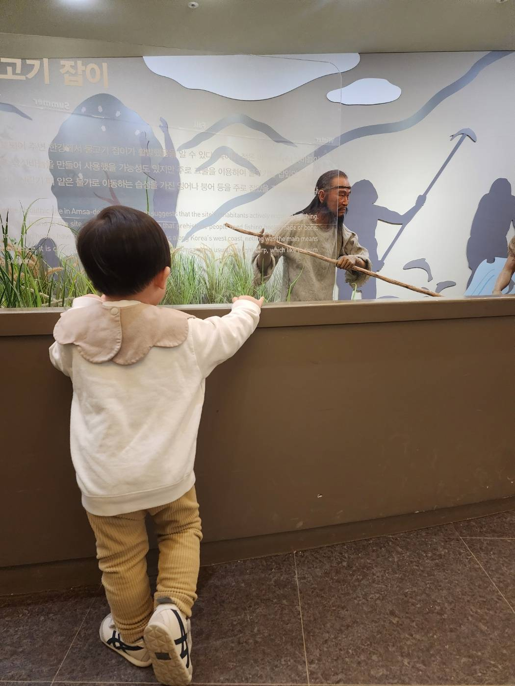
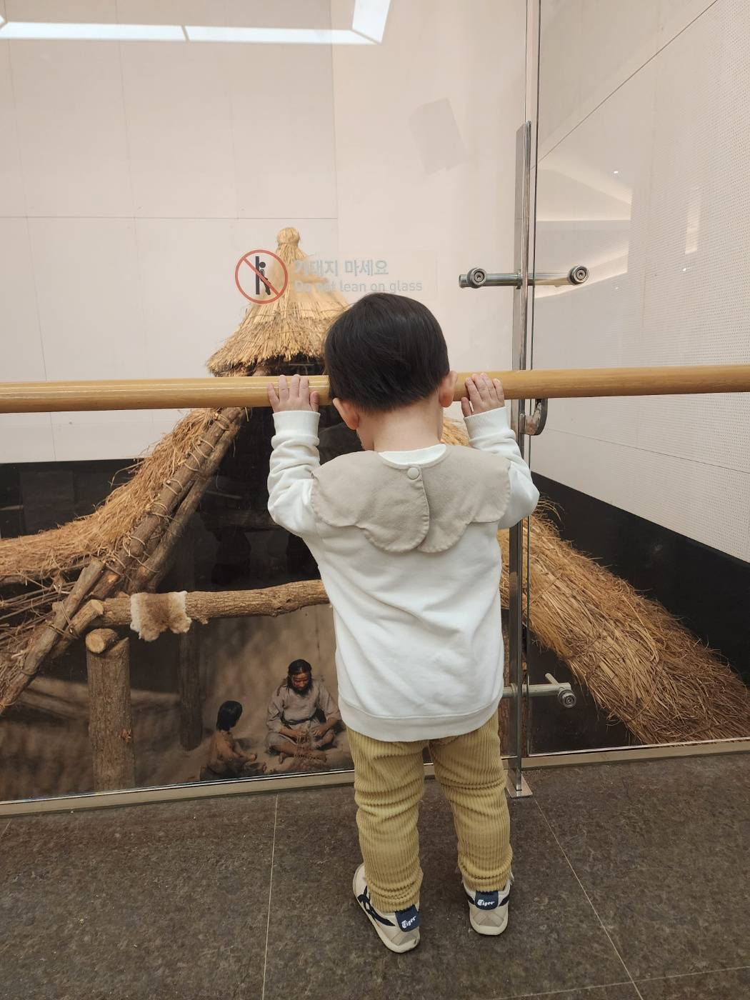

# 18개월 아기와 암사동 선사유적지 — 추운 날에도 실내에서 즐겁게

겨울에 아이와 어디를 가야 할지 고민이라면, **암사동 선사유적지**를 추천합니다. 야외 유적 공원도 있지만, 추운 날에는 실내 박물관만으로도 충분히 시간을 보낼 수 있습니다.

## 물고기 전시 — 아이가 제일 좋아한 곳

1층 전시실에 들어서면 한강에서 잡히던 물고기 표본과 모형이 전시되어 있습니다. 18개월 아기도 알록달록한 물고기 모형에 반응하며 한참을 서서 구경했어요. 눈높이가 딱 맞아서 아이 스스로 다가가 볼 수 있는 게 좋았습니다.

## 선사시대 디오라마 — 신기한 볼거리

물고기 잡이, 사냥하는 선사시대 사람들의 디오라마가 있는데, 아이가 유리 너머로 열심히 쳐다봤습니다. 아직 역사를 이해할 나이는 아니지만, 실물 크기 모형이 주는 시각적 자극만으로도 충분히 흥미로워하더라고요.

## 움집 재현 — 마지막 하이라이트

신석기시대 움집을 재현한 대형 전시물 앞에서 난간을 잡고 한참을 들여다봤습니다. 초가지붕과 안에서 작업하는 사람 모형이 아이의 시선을 사로잡았어요.

## 18개월 아기와 방문 팁

- **실내 위주로 관람**: 추운 날에는 박물관 1~2층만 돌아도 1시간 정도 보낼 수 있음
- **유모차 이용 가능**: 박물관 내부 엘리베이터 있음
- **눈높이 전시**: 전시물이 낮은 위치에도 있어서 걸음마 아기도 직접 볼 수 있음
- **야외 유적 공원**: 날씨 좋으면 움집 복원 구역도 산책 가능

## 실용 정보

- **주소:** 서울시 강동구 올림픽로 875 (암사동 155)
- **관람시간:** 09:30 ~ 18:00 (매주 월요일, 1월 1일 휴관)
- **입장료:** 어른 500원 / 어린이(만7~12세) 300원 / 영유아 무료
- **주차:** 유적지 내 주차장 있음 (운영시간 외 폐쇄)
- **교통:** 8호선 암사역 4번 출구 도보 15분
- **문의:** 02-3425-6520

## 한 줄 평

> 입장료 500원으로 추운 겨울에 아이와 1시간을 알차게 보낼 수 있는 가성비 최고의 나들이 장소.
