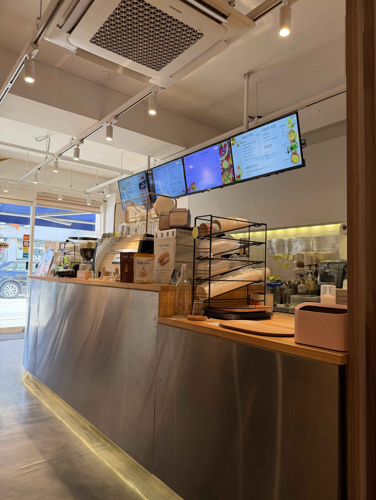
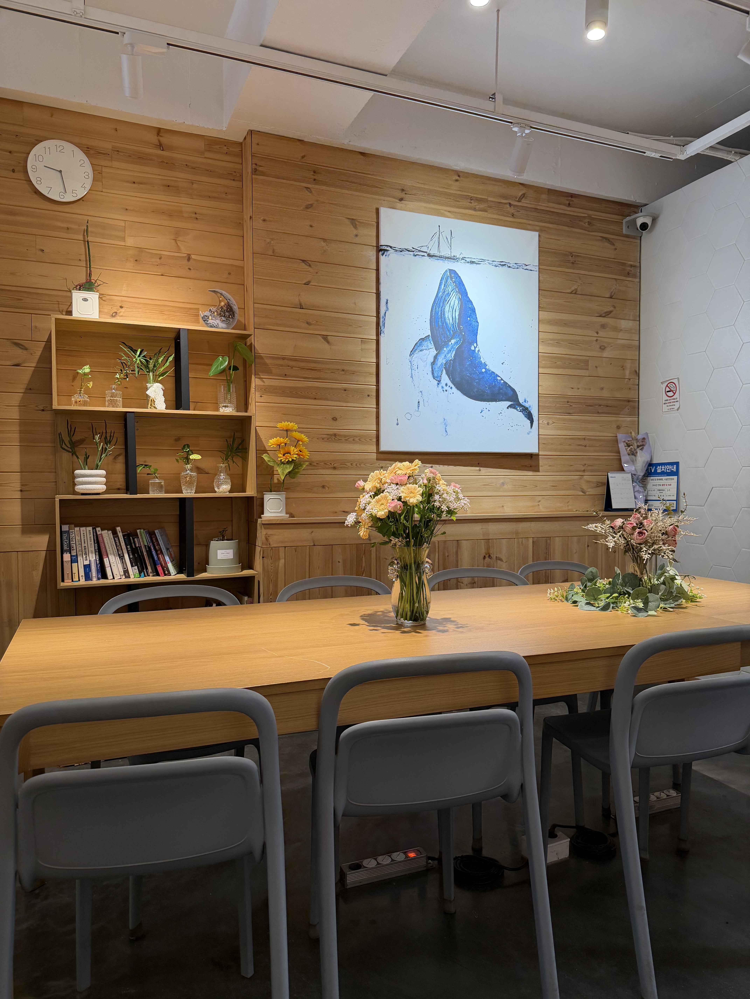
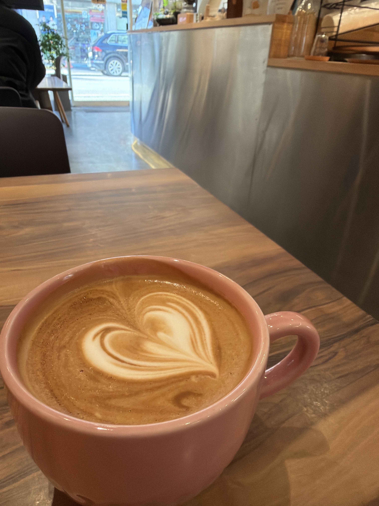
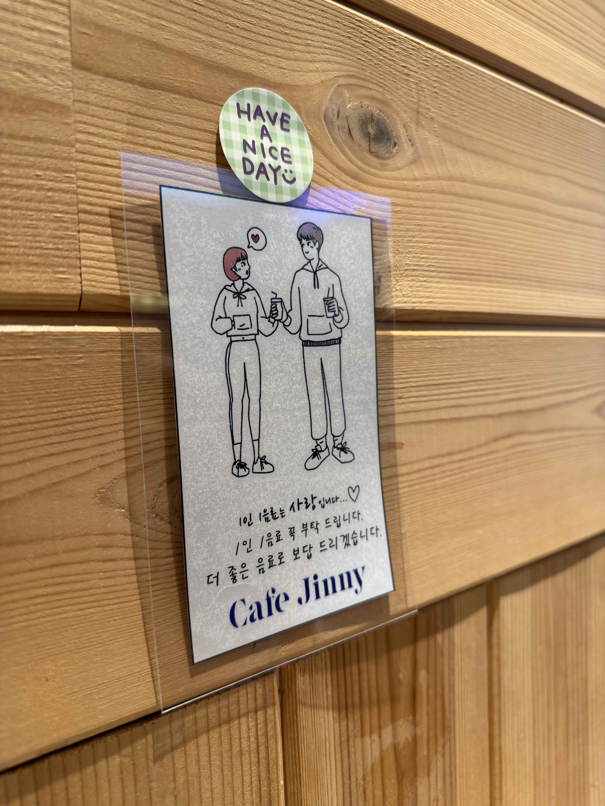

# 카페지니 — 강동구 골목 안에 숨은 따뜻한 동네 카페

솔직히 말하면, 지나가다 우연히 발견한 곳이 아니다. 골목 안쪽이라 일부러 찾아가지 않으면 모르는 위치. 그런데 한 번 들어가면 "여기 괜찮은데?" 하게 되는 카페가 있다.

서울 강동구 천중로43길 34, 1층. **카페지니(Cafe Jinny)**.

## 첫인상 — 스테인리스와 우드의 조합

문을 열면 가장 먼저 눈에 들어오는 건 깔끔한 스테인리스 카운터다. 차갑게 느껴질 수 있는 소재인데, 우드톤 상판과 따뜻한 조명이 절묘하게 중화시킨다. 벽면의 디지털 메뉴판에는 커피부터 스무디, 에이드, 허브티까지 메뉴가 꽤 다양하게 적혀 있다.

카페 규모 자체는 크지 않지만, 오히려 그게 장점이다. 동네 카페 특유의 아늑함이 있다.

## 내부 공간 — 혼자 와도, 여럿이 와도

안쪽으로 들어가면 넓은 우드 테이블이 하나 놓여 있다. 벽면은 편백 느낌의 원목 패널, 그 위에 고래 그림 한 점. 선반에는 화분과 책이 자연스럽게 놓여 있고, 테이블 위 꽃꽂이까지 — 억지스럽지 않은 선에서 감성을 잘 잡았다.

단체석으로도 쓸 수 있는 구조라 소규모 모임에도 괜찮아 보인다. 콘센트도 보이니 노트북 작업하러 오는 사람도 있을 듯.

## 라떼 — 이 집의 진짜 실력

핑크색 머그에 담겨 나온 카페라떼. 라떼 아트가 하트 모양으로 깔끔하게 그려져 있다. 예쁜 건 둘째치고, 한 모금 마셔보면 우유와 에스프레소의 비율이 잘 맞는다는 걸 느낀다. 쓰지도, 밍밍하지도 않은 딱 좋은 밸런스.

프랜차이즈 라떼에 익숙해진 입맛에 "아, 이게 제대로 내린 라떼구나" 싶은 순간이 온다.

## 소소한 디테일들

벽에 붙어 있는 귀여운 일러스트 안내문. "1인 1음료는 사랑입니다 ♡" — 딱딱하게 적어놓은 게 아니라 카페 분위기에 맞게 센스 있게 표현해 뒀다. "더 좋은 음료로 보답 드리겠습니다"라는 문구에서 사장님의 진심이 느껴진다.

이런 작은 디테일이 쌓여서 "다음에 또 와야지"라는 마음을 만든다.

## 찾아가는 법

- 📍 **주소**: 서울 강동구 천중로43길 34, 1층 104호
- 🗺️ **[네이버 지도](https://naver.me/x2hv6k2C)**
- 🚇 **5호선 길동역** 2·3번 출구에서 굽은다리역 방향 직진, 스타벅스 지나 올바른서울병원 옆 골목 좌회전 (도보 약 5분)
- 🚇 **5호선 굽은다리역** 강동구민회관 1번 출구 방향, 올바른서울병원 전 골목 우회전
- 🅿️ 자가용은 '카페지니' 또는 주소 검색. 골목 안쪽이라 눈에 잘 안 띄니 올바른서울병원 뒷블럭 기준으로 찾으면 편하다

## 한 줄 정리

화려하진 않지만 라떼 맛있고, 분위기 좋고, 조용한 강동구 동네 카페. 근처 지나갈 일 있으면 일부러 들를 가치가 있다.
