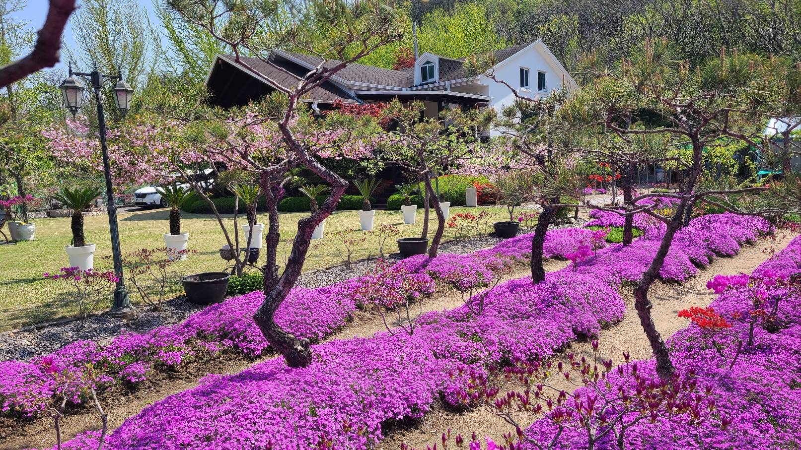

# Cheongpyeonghada Private Pension — River Views & Chef-Level BBQ

I expected a modest yard when I heard "private pension." What I got was something else entirely — a sprawling lawn, panoramic Bukhangang River views, and BBQ grilled by the owner himself. I didn't know places like this existed in Cheongpyeong.

## A Garden That Rivals a Botanical Park

The first impression says it all. Sago palms lined up in white pots, a hillside blanketed in **vibrant purple moss phlox**, and pink double cherry blossoms overhead. Visit in spring and the garden alone is worth the trip. The lawn is maintained to golf-course standards — kids can run barefoot without worry.

Pine trees and ornamental shrubs are thoughtfully arranged, and garden lamps make the atmosphere just as lovely at night.

## The Lawn — Seriously Spacious

The yard is genuinely massive. More than enough room for kids to run around, with lush green mountains wrapping around like a natural screen. The view from the edge of the lawn — sago palms in a row, river beyond — is postcard-worthy.

## Bukhangang River View — From the Living Room, the Loft, Everywhere

The real showstopper is the **view**. Floor-to-ceiling windows in the living room frame the Bukhangang River, and the loft bedroom offers a painting-like panorama of river and mountains. Grab a coffee in the morning and stand by the window — you'll forget you're just an hour from Seoul.

## BBQ — The Owner's Skills Deserve a Michelin Star

Most pension BBQs mean grilling your own meat. Not here. **The owner grills everything for you.** And the skill level is no joke — timing, seasoning, heat control — all spot on. Honestly, if someone told me this was a Michelin one-star experience, I'd believe it.

No effort required on your part. Just sit, eat, and enjoy. That alone is reason enough to come back.

## Practical Info

- **Location:** Cheongpyeong-myeon, Gapyeong-gun, Gyeonggi-do
- **Type:** Private whole-house pension
- **BBQ:** Grilled by the owner (not self-service)
- **Best time to visit:** April–May, when moss phlox and cherry blossoms peak
- **Great for:** Family gatherings, couples, anyone seeking quiet nature

## One-Line Verdict

> Vast lawn + Bukhangang River view + owner-grilled BBQ — this combo is unfairly good.
