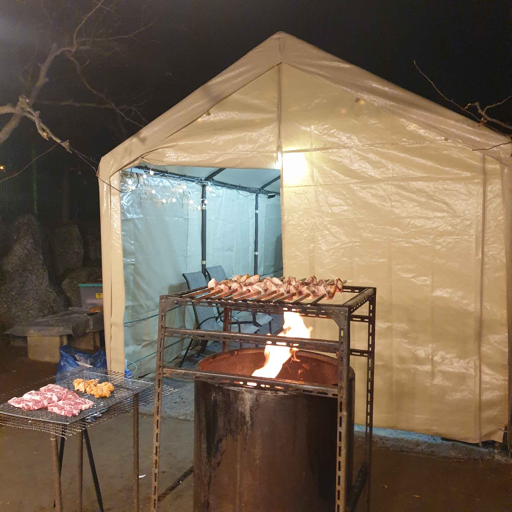

# 청평하다 독채펜션 — 북한강뷰와 미슐랭급 바베큐, 이 조합은 반칙이다

독채펜션이라길래 소박한 마당 정도를 기대했는데, 도착하자마자 스케일에 압도당했습니다. 넓은 잔디마당, 북한강 파노라마, 그리고 주인장이 직접 구워주는 바베큐까지. 청평에 이런 곳이 있었나 싶었습니다.

## 정원이 아니라 식물원

첫인상부터 남다릅니다. 흰 화분에 줄지어 선 소철 나무, 한쪽을 뒤덮은 **보라빛 꽃잔디**, 분홍 겹벚꽃까지. 봄에 방문하면 이 정원만으로도 본전을 뽑습니다. 잔디 상태도 골프장 수준으로 관리가 잘 돼 있어서, 아이들이 맨발로 뛰어다녀도 걱정 없을 정도였습니다.

소나무와 조경수들이 자연스럽게 배치돼 있고, 가든 램프까지 갖춰져 있어 밤에도 분위기가 좋았습니다.

## 넓은 잔디마당

마당이 정말 넓습니다. 아이들이 뛰어놀기에 충분하고, 뒤로는 초록빛 산이 병풍처럼 둘러싸고 있어서 사방이 자연입니다. 소철 화분이 일렬로 늘어선 잔디밭 끝으로 북한강이 보이는 구도가 인상적이었습니다.

## 북한강뷰 — 거실에서, 복층에서, 어디서든

이 펜션의 진짜 무기는 **뷰**입니다. 거실 통유리 너머로 북한강이 시원하게 펼쳐지고, 복층 방에 올라가면 강과 산이 한 폭의 그림처럼 들어옵니다. 아침에 일어나서 커피 한 잔 들고 창가에 서면, 여기가 청평인지 어느 리조트인지 헷갈릴 정도입니다.

## 바베큐 — 주인장의 손맛이 미슐랭 1스타

보통 펜션 바베큐라고 하면 셀프로 굽는 고기를 떠올리는데, 여기는 다릅니다. **주인장이 직접 구워줍니다.** 그리고 이 솜씨가 보통이 아닙니다. 미슐랭 1스타라고 해도 믿을 만큼 고기 굽는 타이밍과 간이 정확했습니다. 불 조절부터 숙성까지 신경 쓴 티가 나는, 진짜 맛있는 바베큐였습니다.

직접 구울 필요 없이 편하게 앉아서 먹기만 하면 되니, 이것만으로도 재방문할 이유가 됩니다.

## 실용 정보

- **위치:** 경기 가평군 청평면 일대
- **유형:** 독채펜션
- **바베큐:** 주인장 직접 조리 (셀프 아님)
- **추천 시기:** 꽃잔디·겹벚꽃이 만개하는 4~5월
- **추천 대상:** 가족 모임, 커플 여행, 조용히 쉬고 싶은 분

## 한 줄 평

> 넓은 잔디마당 + 북한강뷰 + 주인장 바베큐 — 이 셋이 합쳐지면 반칙입니다.
