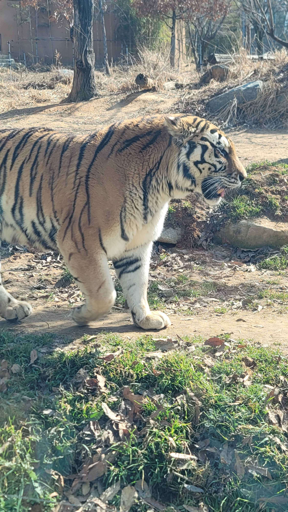
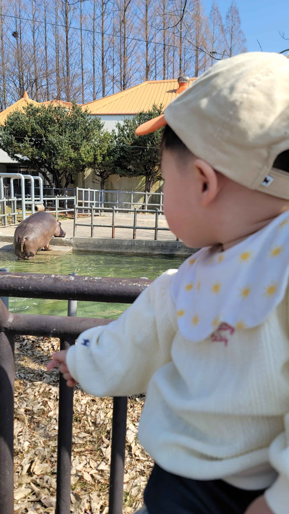
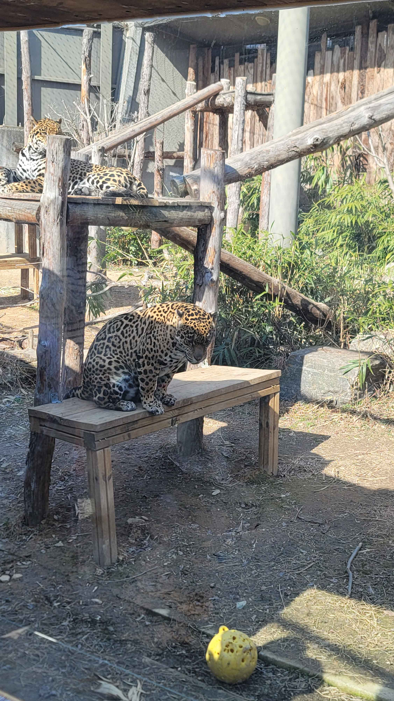
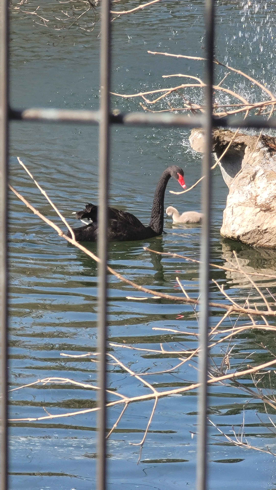

# 전주동물원 — 한옥마을만 보고 가면 앙꼬 없는 찐빵이다

전주 여행 하면 한옥마을, 비빔밥, 초코파이. 대부분 여기서 끝난다. 우리도 처음엔 그랬다. 그런데 18개월 아기를 데리고 한옥마을만 돌기엔 아이가 심심해하고, 어른도 뭔가 아쉽다.

그래서 반신반의하며 들른 전주동물원. 솔직히 "지방 동물원이 뭐 얼마나…" 싶었는데, 결론부터 말하면 **이번 전주 여행의 하이라이트**였다.

## 일단 가격부터 놀랍다

- 성인 3,000원
- 청소년 2,000원
- 어린이 1,000원

커피 한 잔 값도 안 되는 입장료에 주차비도 저렴하다. 서울 근교 동물원 가격을 생각하면 이게 말이 되나 싶을 정도. 무인 매표소에서 간편하게 결제하고 입장하면 된다.

## 리모델링 후 확 달라진 시설

전주동물원이 예전엔 시설이 좀 낡았다는 이야기를 들었는데, 최근 대대적인 리모델링을 거쳐 확연히 달라졌다. 과거의 좁은 시멘트 바닥과 철망 울타리 대신, 넓은 자연형 사육장과 유리 관람대가 생겼다.

덕분에 동물들을 **정말 가까이에서** 볼 수 있다. 이게 전주동물원의 가장 큰 매력이다.

## 호랑이 — 숨이 멎는 현장감

유리 관람대 너머로 호랑이가 성큼성큼 걸어온다. 사진으로는 전달이 안 되는데, 실제로 보면 **근육이 출렁이는 게 그대로 보인다**. 덩치, 발바닥, 이빨… 이걸 이 거리에서 볼 수 있다는 게 믿기지 않았다.

18개월짜리 아기도 호랑이가 다가오니까 눈이 휘둥그레졌다. 무섭다고 울 줄 알았는데 오히려 손으로 유리를 짚으며 신기해했다. 이 하나만으로 전주동물원 온 보람이 있었다.

## 하마 — 아기가 난리 난 순간

물 위로 코만 내밀고 있다가 느릿느릿 올라오는 하마. 18개월 아기가 난간을 붙잡고 하마를 뚫어지게 쳐다봤다. 그림책에서만 보던 동물이 눈앞에서 움직이니까, 아이 입장에서는 완전히 다른 세계가 열린 거다.

이 나이대 아이에게 동물원은 단순한 구경이 아니라 **세상을 처음 인식하는 경험**이다. 부모로서 이런 순간을 함께 할 수 있다는 게 전주동물원의 진짜 가치.

## 표범 — 고양이과의 위엄

나무 선반 위에서 여유롭게 쉬고 있는 표범들. 위아래 2단으로 자리를 잡고 각자의 시간을 보내는 모습이 꼭 대형 고양이 같다. 대나무와 통나무로 꾸며진 사육장이 자연스럽고, 동물들도 편안해 보였다.

리모델링의 효과가 가장 잘 드러나는 곳 중 하나다. 예전 사진과 비교하면 환경이 정말 많이 좋아졌다.

## 흑고니 가족 — 뜻밖의 힐링

맹수관을 지나 걷다 보면 만나는 호수. 흑고니(Black Swan) 가족이 유유히 헤엄치고 있었다. 어미 옆에 바짝 붙어 따라다니는 새끼 한 마리. 물 위에 비치는 햇살과 어우러져 그냥 이 풍경만으로도 힐링이 됐다.

동물원 곳곳에 정자와 벤치가 있어서 쉬엄쉬엄 돌아보기 좋다.

## 실전 팁

- ⏱️ **소요 시간**: 천천히 돌면 1시간 30분~2시간
- 🍱 **먹거리 부족**: 내부에 편의점과 스낵바가 있긴 하지만 종류가 제한적. **도시락이나 간식을 싸가는 걸 추천**
- 💰 **현금 챙기기**: 곳곳의 음료 자판기가 대부분 현금 전용
- 🌸 **벚꽃 시즌 주의**: 벚꽃 명소로도 유명해서 개화 시기에는 주차가 매우 어려움. 이 시기엔 대중교통 추천
- 🎢 **드림랜드**: 동물원 안에 소규모 놀이공원이 있다. 놀이기구보다는 레트로 감성 사진 찍기 좋은 곳
- 🕘 **운영시간**: 하절기(3~10월) 09:00~19:00 / 동절기(11~2월) 09:00~18:00

## 찾아가는 법

- 📍 **주소**: 전북 전주시 덕진구 소리로 68
- 🗺️ **[네이버 지도](https://naver.me/Fx5tDqWR)**
- 🅿️ 동물원 입구에 넓은 주차장 있음 (벚꽃 시즌 제외)

## 한 줄 정리

성인 3,000원에 호랑이를 코앞에서 보고, 아이는 세상을 처음 만나고, 흑고니 가족 보며 힐링까지. 전주 와서 한옥마을만 보고 간다면, 진짜 앙꼬 없는 찐빵이다.
